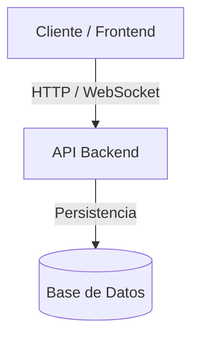

# Topología Física y Lógica del Sistema

```mermaid
graph TD
    Client["Cliente / Frontend"] -->|HTTP / WebSocket| API["API Backend"]
    API -->|Persistencia| DB[("Base de Datos")]
```

*(Actualizar con los servicios reales definidos en `specs/STACK.md`).*
